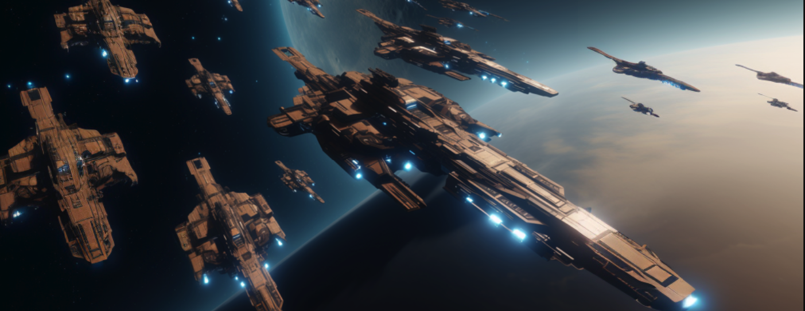

# Dark Armada: Masters of  the Void

### This is the second iteration of Dark Armada, re-written for protokit from Mina L1 (and the third version of the game)

The prior versions and experiments of the game can be found at: 

* The First iteration is written on Mina L1  [Dark Armada](https://github.com/Cloakworks-collective/dark_armada)
* The very first experiments of the concepts can be found at [DarkForest Mina](https://github.com/enderNakamoto/Darkforest_Mina)

## Table of Contents

- [Background](#background)
- [Introduction to the game](#introduction-to-the-game)
- [How are Planets spawned?](#how-are-planets-spawned)
- [How are Planets discovered?](#how-are-planets-discovered)
- [How Battles work?](#how-battles-work-)
- [ZKPs in the game:](#zkps-in-the-game-)
  * [Planet Initiation](#planet-initiation)
  * [Fleet Initialization (Defending a Planet)](#fleet-initialization--defending-a-planet)
  * [Battle computation](#battle-computation)
- [Appchain Architecture:](#appchain-architecture)
  * [How are inputs kept private?](#how-are-inputs-kept-private)
- [Numerical Insights on spawning:](#numerical-insights-on-spawning)
- [Mining Planets (Benchmarking)](#mining-planets--benchmarking)
    + [Poseidon hashing on M1 Mac](#poseidon-hashing-on-m1-mac)
    + [Keccak256 hashing on M1 Mac](#keccak256-hashing-on-m1-mac)
    + [Chain Poseidon hash on M1 Mac](#chain-poseidon-hash-on-m1-mac)
- [Running tests](#running-tests)
- [Development Progress](#development-progress)
- [References](#references)


## Background

"Dark Armada: Masters of the Void" is a massively multiplayer online (MMO) game that leverages Zero Knowledge Proofs (ZKPs) to engineer a verifiable fog of war. Drawing inspiration from the original "Dark Forest zkSNARK space warfare" game, which was built on EVM using Circom circuits, this new iteration is crafted in O1js—a TypeScript embedded DSL dedicated to ZK applications. Significantly, this game version is uniquely redesigned as an appchain rollup on the Mina L1 blockchain, utilizing "Protokit" for development. The game mechanics have also been extensively overhauled to deepen strategic elements and offer a gameplay experience distinctively different from the original "Dark Forest."

## Introduction to the game 

Imagine a vast galaxy filled with countless planets, each fortified and ready for interstellar warfare. As a player, you enter this universe by taking command of one of these planets, becoming its ruler and protector. In this cosmic adventure, players control planets and secretly arrange defensive fleets. These fleets remain hidden from opponents through the use of zero-knowledge proofs (zk-SNARKs). 

Both the coordinates of the planets and their defensive strategies are kept confidential; only the hashes of these coordinates and tactics are recorded on-chain in the Protokot rollup Statemap. Details of the planetary defenses and the exact coordinates are processed locally and never leave the player's computer, ensuring the utmost privacy of strategic information.

## How are Planets spawned?

Creating a universe that balances realism with engaging gameplay presents a unique challenge. To generate planet coordinates, we employ Poseidon hash functions, tweaking the rarity of these coordinates by altering the number of leading zeros in the hash values. This method creates a randomized yet controlled distribution of planets, essential for gameplay dynamics.. The process of finding these difficult hashes is somewhat akin to the mining process in Bitcoin.

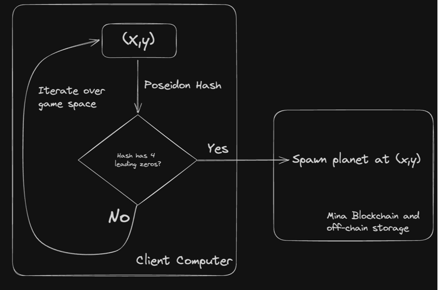

## How are Planets discovered?

Planet coordinates are kept private, with only their Poseidon hash values stored in rollup statemap. Players must "mine" to uncover the concealed coordinates of other planets, scanning the vast universe with limited range and employing Poseidon hash collision techniques to discover them. Picture yourself navigating the immense universe, where you're limited to scanning (enumerating) the nearby space—using hash collision to seek out other planets.

Here is the 2 step process of Initiating a planet, and "mining" for the location of the planet: 

Step 1: Initiating Planets

A player picks a co-ordinate, e.g. (3,1), and generates proof that those co-ordinates are within the game universe. Once the proof is verified on Protokit Appchain Runtime, the location hash is stored in the rollup statemap.

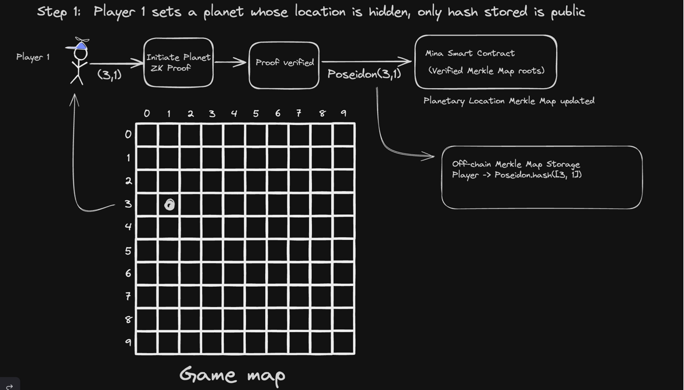

Step 2: Mining (Discovering Hidden Planets)

Other players, represented by Player 2 here, "mines" for the location of planets. Player 2 iterates over pairs of co-ordinate values (x, y), applying the Poseidon hash function to each pair, and comparing the resulting hash to the hash of a specific pairs, that has initiated planets. In our example [3,1] is one such pair.

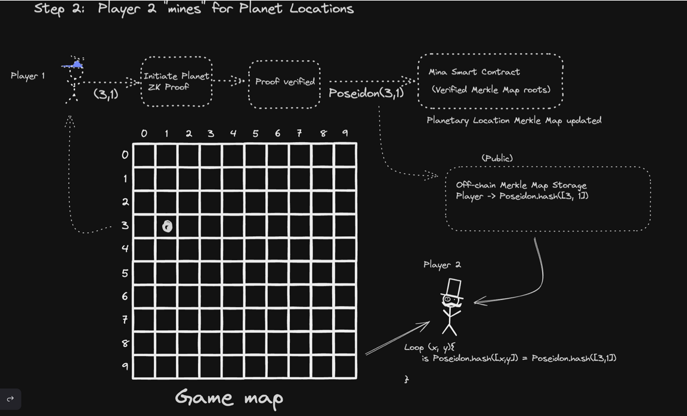

## How Battles work? 

Once a player discovers another planet, they have the option to "attack" it. However, the defensive measures of the planet remain confidential, while the attacks are conducted openly. The outcome of the defense, whether successful or not, results in the leakage of some information, enabling future attackers to formulate educated guesses about the planet's defenses.

Here's the 4 step process of how battles work: 

Step 1: Initiating Defense Fleet

Player 1 (Planet owner), sets up a hidden defense fleet for a planet. The details of this fleet are kept private and stored off-chain. To validate the existence and the integrity of the fleet without revealing its specifics, a zero-knowledge proof (ZK Proof) is generated and then verified in appchain runtime. Once the proof is verified, the defensehash (and not the details) are stored in Rollup Statemap.

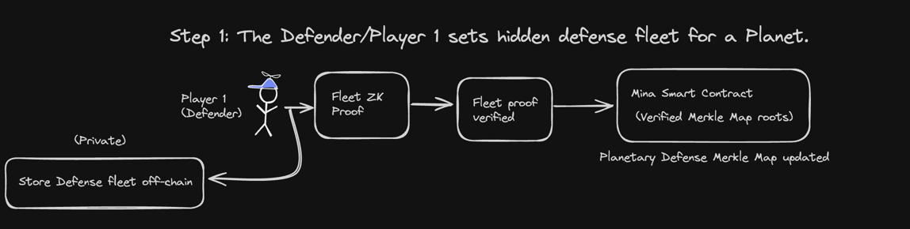

 Step 2: Public Attack

Player 2 initiates a public attack on a planet by deploying an attack fleet, the details of which are stored off-chain but visible to all. A zero-knowledge proof for this fleet is generated and verified. Upon successful verification, the Mina smart contract is updated to include the new proof in the verified Merkle Map roots.

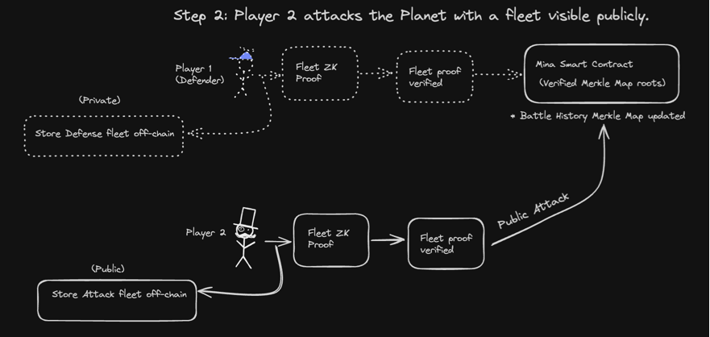

Step 3: Battle Computations

 Since only the defender (Player 1) possesses complete knowledge of their defense fleet, they are responsible for calculating the outcome of the battle, taking into account both their private defense details and the publicly known attacking fleet. They must then submit both the proof and the result of the battle on-chain. This two-step resolution process, although less than ideal, affects the user experience. Unfortunately, it was the only method I could devise to ensure a fair and verifiable battle.

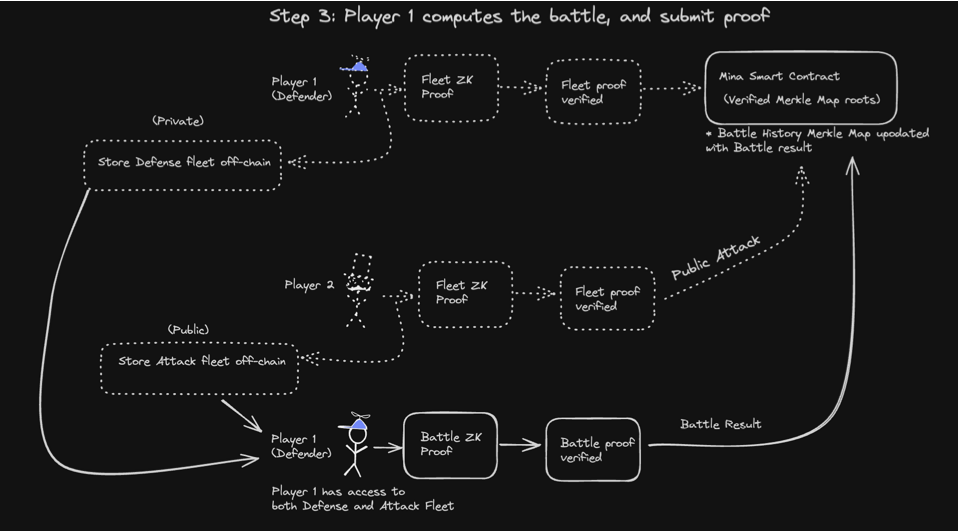

Step 4: Forfeiting an Attack

If the defender (Player 1) anticipates that an incoming attack will likely lead to a defeat, they may opt to "ghost" the attacker by failing to submit the required proof. To address this scenario, we've introduced a "collect forfeit" mechanism. This allows an attacker (Player 2) to essentially loot the planet if the defender does not provide proof of defense within a specified timeframe.

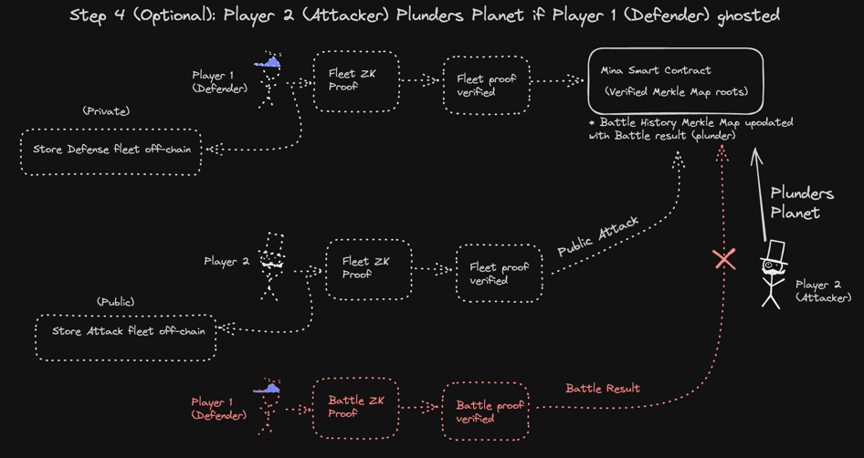

## ZKPs in the game:

Dark Armada uses ZKP to prove 3 operations regarding planet location and fleet engagements: 

1. Planet initiation - verify that the location is within the game universe.
2. Planet defense initialization - verify that the defense fleet follows game rules regarding fleet composition and maximum strtength.
3. Battle Computation - verify that the battle computation is correct based on the engagement rules.

### Planet Initiation 

While initiating a planet we submit a proof three things: 

1. Initiated Planet co-ordinates are within the game universe.
2. Chosen Faction of the Planet is valid
3. And the difficulty of the locationHash is valid

This Proof is generated in Player's local machine, and submitted to protokit runtime where the proof is verified and the action is further verified against on-chain data before a planet os created 


### Fleet Initialization (Defending a Planet)

While initiating a planetary defense, or assembling an attack fleet to attack other planets
We check that the max cost limit for assembling such fleet was observed 

```typescript
 static verifyCost(defense: PlanetaryDefense){
        const totalCrew = defense.totalCost();
        totalCrew.assertLessThanOrEqual(
            Consts.MAX_DEFENSE_COST, 
            Errors.PLANETARY_DEFENSE_COST
        );
    }
```

### Battle computation 

Last, but not the least - we compute fleet battles on client computer of the defender and submit the proof to be validated. 

```typescript
    static computeSimpleWinner(
        attack: AttackFleet, 
        defense: PlanetaryDefense
    ): Bool {
    const attackeBattleships = attack.battleships.mul(
        Consts.BATTLESHIP_STRENGTH
        );
        const attackeDestroyers = attack.destroyers.mul(
        Consts.DESTROYER_STRENGTH
        );
        const attackeCarriers = attack.carriers.mul(Consts.CARRIER_STRENGTH);

        const defenderBattleships = defense.battleships.mul(
        Consts.BATTLESHIP_STRENGTH
        );
        const defenderDestroyers = defense.destroyers.mul(Consts.DESTROYER_STRENGTH);
        const defenderCarriers = defense.carriers.mul(Consts.CARRIER_STRENGTH);

        //  battleships > destroyers
        const battleshipsBeatsDestroyers =
        attackeBattleships.sub(defenderDestroyers);

        // destroyers > carriers
        const destroyersBeatsCarriers = attackeDestroyers.sub(defenderCarriers);

        // carriers > battleships
        const carriersBeatsBattleships = attackeCarriers.sub(defenderBattleships);

        const battleResult = battleshipsBeatsDestroyers
        .add(destroyersBeatsCarriers)
        .add(carriersBeatsBattleships);

        const defended = Provable.if(
        battleResult.greaterThanOrEqual(Field(1)),
            Bool(true),
            Bool(false)
        );

        return defended;
    }
```

Now let's explain the `computeSimpleWinner() function`.In the game POC, as of now the fleets consist of 3 units - Battleships, Destroyers and Carriers


In the Rock-Paper-Scissor esque fashion, some units perform better (has an advantage over other units)
1. Battleship: Powerful and heavily armored, capable of enduring a lot of damage. Its strength lies in its ability to overpower Destroyers with its superior firepower.
2. Destroyer: Equipped with fast, agile, and specialized in anti-aircraft and missile defense systems. It can effectively protect against and neutralize Carriers by intercepting their aircraft and missiles.
3. Carrier: Launches aircraft and drones, providing a significant advantage over Battleships by attacking from a distance and avoiding direct firepower.

For now, We simply find winners of Battleship-Destroyer, Destroyer-Carrier and Carrier-Battleship engagements, and the player who won 2 out of 3 engagements in vrowned the winner.
This is subject to more change as the game evolves.

A much more complicated battle systed is a Work In progress

## Complex Battle System (Work In progress)

Since the Battle between the two fleets are computed in the local machine, and only the proof is forwarded to the Protokit runtime, 
we can increase the battle complexity to increase the strategic depth of he game. 

Here's the complex battle system that takes advantage of the scalability of the Protokit/Mina Architecture: 

### Units
These are the units participating the in complex battle: 

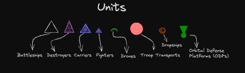

The fleet composition is as follows: 

```typescript
export interface AttackingFleet {
  battleships: UInt64,
  destroyers: UInt64,
  carriers: UInt64,
  fighters: UInt64,
  drones: UInt64,
  troopTransports: UInt64,
  dropShips: UInt64,
}

export interface DefendingFleet {
  battleships: UInt64,
  destroyers: UInt64,
  carriers: UInt64,
  fighters: UInt64,
  drones: UInt64,
  odps: UInt64,
}
```

The Battle Happens in several phases Phases. Let's look at an example battle to understand the phases

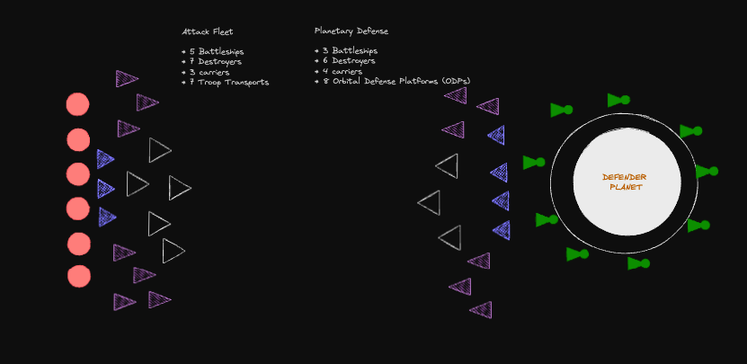

### Phase 1 - The Long Range Engagement

During the initial phase of the engagement, both destroyers and battleships deploy missiles aimed at incapacitating the opposing fleet. Simultaneously, they launch interceptors with the goal of neutralizing incoming missiles. This dual-action forms the first line of defense and attack, where each fleet's success depends on the effectiveness of their interceptors in disabling the threats from the opposing side.

As missiles penetrate through the opposing fleet's interceptor defenses, they then target individual ships. At this stage, the ships' point defense cannons (PDCs) come into play. These cannons are crucial for the last line of defense, tasked with destroying any remaining missiles that have evaded the initial wave of interceptors.

When the PDCs of a ship reach their capacity and can no longer effectively defend against incoming missiles, the ship becomes vulnerable. Overwhelmed by the missile barrage, these ships are either disabled or destroyed, removing them from the ongoing battle. This process decisively impacts the fleet's operational capabilities and can significantly alter the course of the engagement.

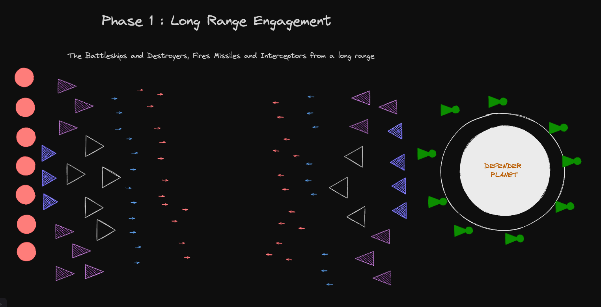

### Phase 2 - Capital Ship Engagement

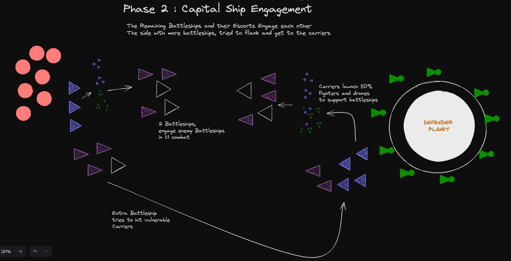

### Phase 3 - Carrier Engagement 

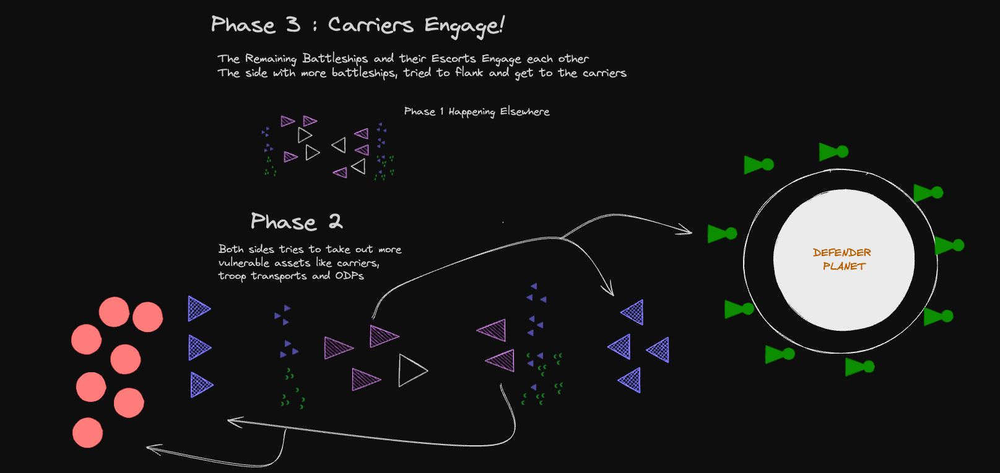

### Phase 4 - Planetfall

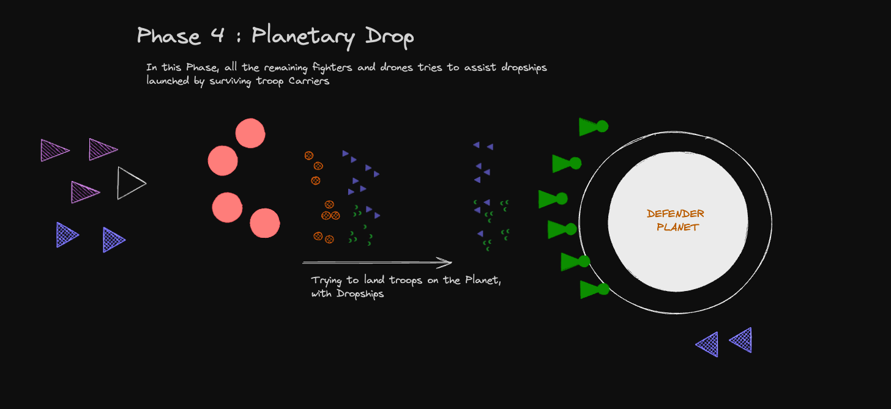

## Appchain Architecture: 

### How are inputs kept private? 
The private inputs are processed by zkPrograms which produces proof, and then passed into runtime methods for verification. The private inputs never leave local machine

The public inputs are directly fed into runtime methods of the appchain.

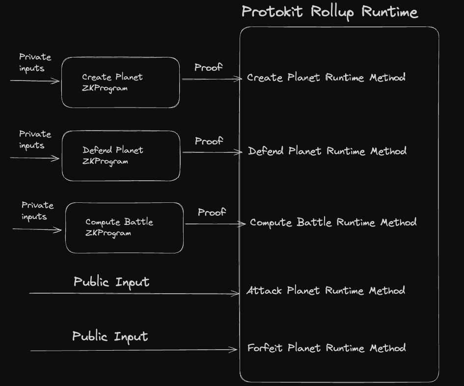

## Numerical Insights on spawning:

The scripts for the numerical tests is in `helpers/birthing.ts` of [DarkForest Mina](https://github.com/enderNakamoto/Darkforest_Mina)

**Initial Test**: On a 200 x 200 grid (40,000 locations), the number of planets varied significantly with the change in leading zeros:

* With one zero, 7,151 planets (17.8775%)
* With two zeros, 243 planets (0.60825%)

Increasing leading zeros requirement  further drastically reduced the number of planets.

## Mining Planets (Benchmarking)

The coordinates of planets are stored as private data and are not publicly disclosed.The only information available to the public is the Poseidon hash of these coordinates, leveraging the Poseidon.hash([x, y]) function, known for its efficiency in SNARK-friendly environments.

In a game arena, be it a square grid of dimensions N x N or a circle with radius R, the objective is to discover the private coordinates of all planets. This is achieved through identifying hash collisions - by generating and comparing the Poseidon hashes for every possible coordinate pair within the game's defined space.

The experiment at `helpers/exp/mining.ts` in [DarkForest Mina](https://github.com/enderNakamoto/Darkforest_Mina)  aims to determine the time frame necessary to uncover the coordinates of all planets via hash collisions. The findings from this experiment will be pivotal in defining the size of the search space (game world), ensuring it offers an adequate level of challenge while maintaining cryptographic integrity.

We also compare Poseidon with with Keccak 

#### Poseidon hashing on M1 Mac
* time taken to hash 100 coordinates: 29 ms
* time taken to hash 1000 coordinates: 253 ms
* time taken to hash 10000 coordinates: 2475 ms

#### Keccak256 hashing on M1 Mac
* time taken to hash 100 coordinates: 124 ms
* time taken to hash 1000 coordinates: 1043 ms
* time taken to hash 10000 coordinates: 10320 ms

Hashing with `Hash.SHA3_256.hash(bytes), Hash.SHA3_512.hash(bytes) and Hash.SHA3_384.hash(bytes)`, yielded similar results to keccak256 

Therefore, it might be better to use the Keccak hash to save planet locations publicly to add extra layer of protection. Ironically, because Keccak is less efficient, it yields better protection.

On [Shigoto-dev19](https://github.com/Shigoto-dev19)'s, recommenation, chain Poseidon hash, was experimented with is to create a final hash, where we hash a Field to itself N number of times to increase the hashing time.

#### Chain Poseidon hash on M1 Mac 
* time taken to hash 100 coordinates: 25062 ms

Therefore, We can arbitrarily increase the time needed to hash every co-ordinate to make this super hard for anyone to bruteforce all the co-ordinates in the map easily.

e.g. with a N of 100,000 -  hasing 100 co-ordinates will take more than 4 minutes. 

Thus, given a big enough universe, it would be quite hard for anyone to bruteforce all the co-ordinates.

## Running tests
```zsh
cd packages/chain
npm test -- --verbose
```

The test results: 
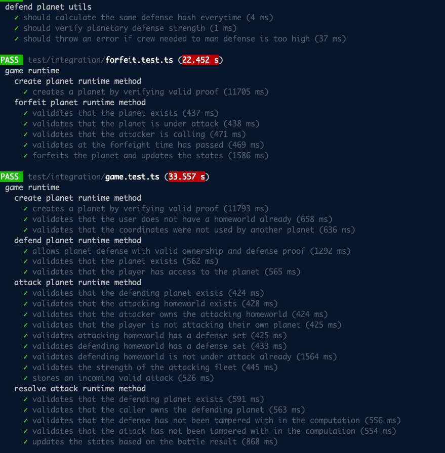

There are both Unit and Integration Tests that can be found in the `test` folder of `packages/chain`

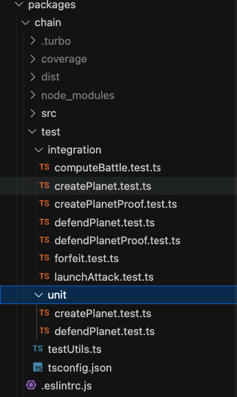

## Development Progress

* :white_check_mark: Mining Benchmark
* :white_check_mark: Spawning Benchmark
* :white_check_mark: Fleet ZKP
* :white_check_mark: Init Plamet ZKP
* :white_check_mark: Battle ZKP
* :white_check_mark: Contract Composition 
* :white_check_mark: Re-writing it in Protokit to solve the issue of off-chain storage
* :white_check_mark: Test Coverage 
* :wrench: A More complex Battle System
* :wrench: Game Simulation
* :x: UI - contract interaction
* :x: UI - Initiate planet 
* :x: UI - Mine for planet locations


## References 

* [Simple Game Explanation](https://trapdoortech.medium.com/dark-forest-one-interesting-game-with-zk-snark-technology-47528fa7691e)
* [ZK Global Game Overview](https://www.youtube.com/watch?v=nwUCccUS75k)
* [Original DF git repo](https://github.com/darkforest-eth)

