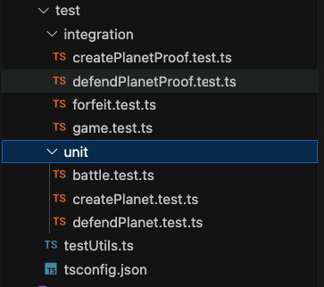

# Dark Armada Protokit Repo - based on the Protokitstarter-kit

This repository is a monorepo aimed at kickstarting application chain development using the Protokit framework.

## Quick start

The monorepo contains 1 package and 1 app:

- `packages/chain` contains everything related to your app-chain
- `apps/web` contains a demo UI that connects to your locally hosted app-chain sequencer

**Prerequisites:**

- Node.js v18
- pnpm
- nvm

> If you're on windows, please use Docker until we find a more suitable solution to running the `@proto-kit/cli`. 
> Run the following command and then proceed to "Running the sequencer & UI":
>
> `docker run -it --rm -p 3000:3000 -p 8080:8080 -v %cd%:/starter-kit -w /starter-kit gplane/pnpm:node18 bash`


### Setup

```zsh
git clone https://github.com/proto-kit/starter-kit my-chain
cd my-chain

# ensures you have the right node.js version
nvm use
pnpm install
```

### Running tests
```zsh
cd packages/chain
npm test -- --verbose
```

The test results: 


There are both Unit and Integration Tests that can be found in the `test` folder of `packages/chain`



The test coverage was worked on

